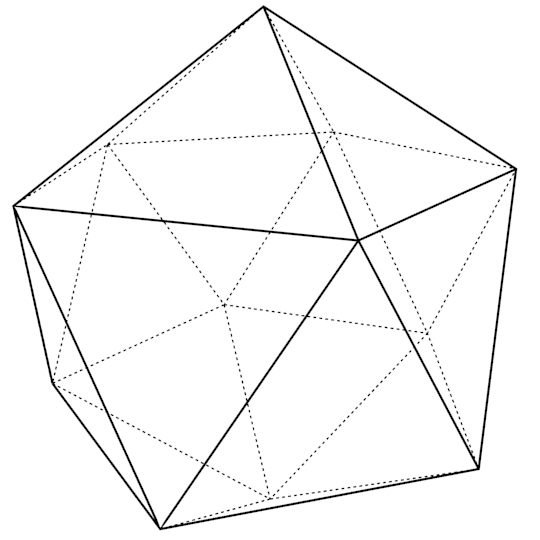
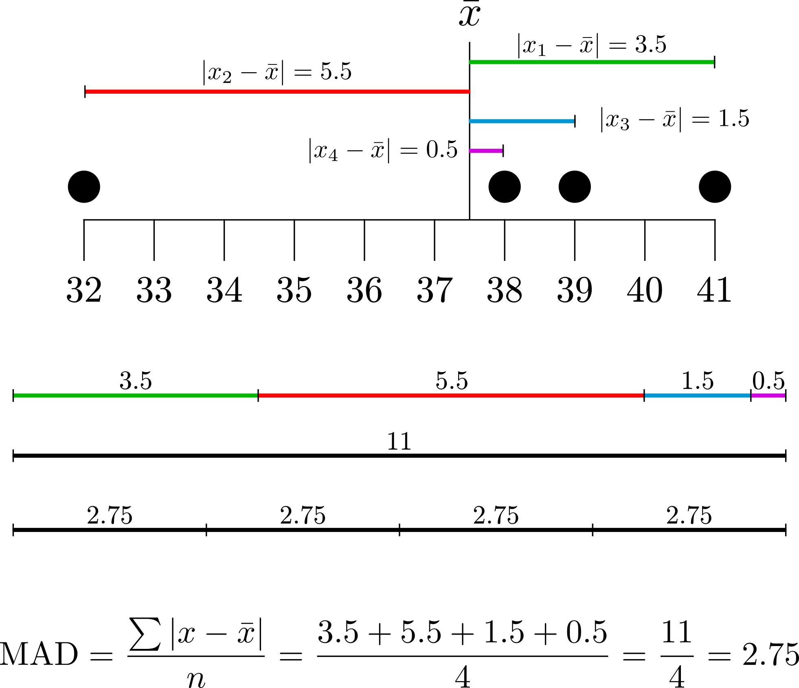

```{r setup, include=FALSE}
knitr::opts_chunk$set(echo = FALSE)
```

## Statistics overview

* From a given random process, we can make **probability** statements about what we expect to happen.
    - The random process can be:
        * A random sample (of size $n$) is taken from a much larger population
        * A random number generator is rolled $n$ times.
* From a given sample, we can **infer** what the population/spinner looks like.


## Measures of spread

* Range
* Inter-quartile range (IQR)
* Mean absolute deviation (MAD, average absolute deviation, AAD)
* Standard deviation
* (Bessel corrected) sample standard deviation.


## Range

* Range is the difference between maximum and minimum.
$$\text{Range} = \max-\min $$
* Example:
$$\text{sample} = \text{8,5,20,6,5,4,19} $$
$$\text{range} = 20-4 = 16 $$


## The problem with range...

* A sample's range often underestimates the population's range. 
* A sample's range often underestimates a spinner's range.
* When we use a sample statistic (like sample's range) to estimate a population parameter (like population's range), we call that sample statistic an "estimator".
* Range is a **biased estimator**. 

## Example: icosahedron

\vspace{-10pt}
```{r pressure, echo=FALSE, fig.align='right', out.width = '20%'}

```

* Take a 20-sided die. It should be equally likely to land on any integer between 1 and 20. (Discrete Uniform Distribution)
* We say the population has a range of 19, because 20-1=19.
* I rolled 30 20-sided dice:
```{r icosahedron,fig.height=3,fig.align='center',fig.width=6}
set.seed(123)
n = 30
x = sample(1:20,n,T)
rs = cummax(x)-cummin(x)
stripchart(x,method="stack",xlim=c(0,21),at=0.2,pch=20,cex=2,offset=0.5,axes=F)
axis(side=1,at=1:20,labels=1:20)
```
* The sample range is `r max(x)-min(x)`.
* Is it possible for a sample range to be larger than the population range?


## Repeat the 30 rolls many times.

I "rolled" a 20-sided die 30 times, 1000 times. For each sample of 30 rolls, the sample's range was determined. Notice the sample range never was larger than the population range.

```{r icosahedron2,fig.width=4,fig.height=3,fig.align='center'}
set.seed(1234)
rs = numeric()
for(i in 1:1000){
  n = 30
  x = sample(1:20,n,T)
  rs = c(rs,max(x)-min(x))
}
hist(rs,breaks=seq(min(rs)-0.5,max(rs)+0.5,by=1),xlab="range",ylab="frequency",main="histogram of ranges")
```


## IQR

* We will come back to inter-quartile range another day.
* IQR is the difference between the 75th percentile and the 25th percentile. 
* The 75th percentile is the smallest value larger (or equal) to 75% of the other values.

## Mean absolute deviation

$$\text{MAD} ~~=~~  \frac{\sum |x-\bar{x}|}{n}$$

The mean absolute deviation represents how far from center the values are on average.

* Example: sample = {41, 32, 39, 38}

| $x$ | $x-\bar{x}$ | $\lvert x-\bar{x} \rvert$ |
|:---:|:---:|:---:|
| 41 | 3.5 | 3.5 |
| 32 | $-5.5$ | 5.5 |
| 39 | 1.5 | 1.5 |
| 38 | 0.5 | 0.5 |
|========|========|========|
|$\sum x = `r 41+32+39+38`$| | $\sum \lvert x-\bar{x} \rvert = 11$|
|$\bar{x} = 37.5$| | $\text{MAD} = \frac{11}{4} = 2.75$ |


## Mean absolute deviation

```{r madd, echo=FALSE, fig.align='center', out.width = '80%'}

```


## Standard deviation

* Standard deviation without Bessel correction:
$$s = \sqrt{\frac{\sum (x-\bar{x})^2}{n}} $$
* Standard deviation with Bessel correction (sample standard deviation):
$$s = \sqrt{\frac{\sum (x-\bar{x})^2}{n-1}} $$
* The Bessel correction makes the estimator less biased.

## Standard deviation example

* Example: sample = {41, 32, 39, 38}

| $x$ | $x-\bar{x}$ | $( x-\bar{x} )^2$ |
|:---:|:---:|:---:|
| 41 | 3.5 | 12.25 |
| 32 | $-5.5$ | 30.25 |
| 39 | 1.5 | 2.25 |
| 38 | 0.5 | 0.25 |
|========|========|========|
|$\sum x = `r 41+32+39+38`$| | $\sum ( x-\bar{x} )^2 = 45$|
|$\bar{x} = 37.5$| |  |

$$s = \sqrt{\frac{\sum (x-\bar{x})^2}{n-1}} = \sqrt{\frac{45}{4-1}} = \sqrt{15} \approx 3.87$$

## Estimating standard deviation from a histogram

| Shape | Estimated $s$ |
|:---:|:---:|
| Bell | $s \approx \frac{\text{range}}{6}$ |
|||
| Uniform | $s \approx \frac{\text{range}}{4}$ |
|||
| Bimodal | $s \approx \frac{\text{range}}{2}$ |


## Estimating standard deviation from a histogram

```{r bell,fig.width=4,fig.height=3}
set.seed(14)
x = rnorm(1000)
s = sd(x)
sa = (max(x)-min(x))/6
hist(x)
```

$$s \approx \frac{6}{6} = 1 $$

The actual value is `r sd(x)`

## Estimating standard deviation from a histogram

```{r uniform,fig.width=4,fig.height=3}
set.seed(14)
x = 40+10*runif(1000)
hist(x)
```

$$s \approx \frac{10}{4} = 2.5  $$

The actual value is `r sd(x)`


## Estimating standard deviation from a histogram

```{r bimod,fig.width=4,fig.height=3}
set.seed(14)
x = 120+40*rbeta(1000,0.4,0.4)
hist(x)
```

$$s \approx \frac{40}{2} = 20  $$

The actual value is `r sd(x)`


<!-- ## Roulette wheel -->

<!-- A (European) roulette wheel has 37 equally likely possible outcomes. -->

<!-- ```{r roulette,fig.height=3,fig.width=3,fig.align='center'} -->
<!-- nums = "0-32-15-19-4-21-2-25-17-34-6-27-13-36-11-30-8-23-10-5-24-16-33-1-20-14-31-9-22-18-29-7-28-12-35-3-26" -->
<!-- nums = strsplit(nums,"-")[[1]] -->
<!-- ints = as.integer(nums) -->
<!-- par(mar=c(0,0,0,0)) -->
<!-- plot(0,0,type='n',ann=F,axes=F) -->
<!-- thetas = seq(0,2*pi,length.out=370) -->
<!-- lines(cos(thetas),sin(thetas)) -->
<!-- for(i in 1:37){ -->
<!--   lines(c(0,sin((i-0.5)/37*2*pi)),c(0,cos((i-0.5)/37*2*pi))) -->
<!--   text(c(0,sin((i-1)/37*2*pi))*0.9,c(0,cos(((i-1)/37*2*pi)))*0.9,ints[i],cex=0.9,srt=-(i-1)/37*360) -->
<!-- } -->
<!-- ``` -->
